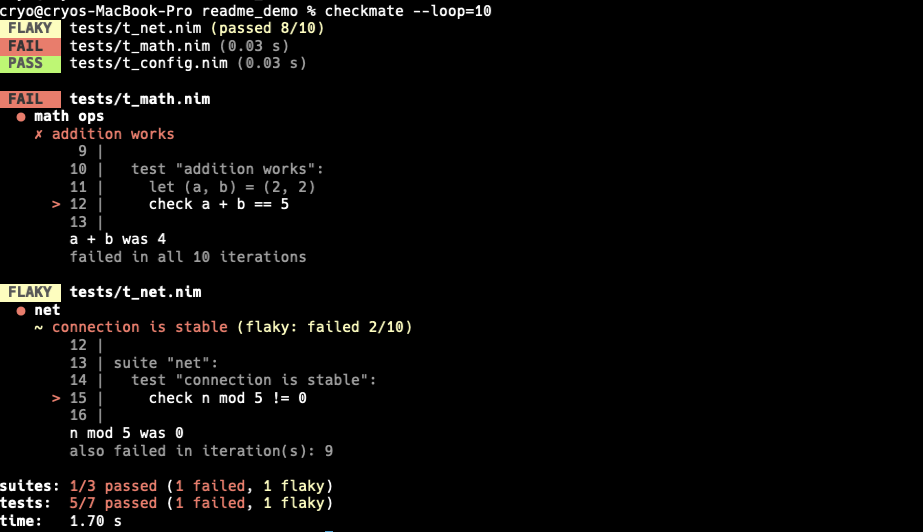

# checkmate

[](https://github.com/cryo2010/nim-checkmate/actions/workflows/ci.yml)
[](LICENSE)

A test runner for Nim, inspired by [jest](https://jestjs.io/). The CLI discovers,
compiles, and runs your unmodified `std/unittest` files in parallel, with advanced
features like flake detection, line coverage and time travel.



## Features

- **Zero setup**: discovers and runs your unmodified `std/unittest`
  files; nothing in your tests needs to change.
- **Parallel**: compiles and runs test files concurrently
- **Flake detection**: `--loop N` reruns the suite to surface flaky
  tests, reporting per-iteration pass/fail ratios.
- **Rich failure output**: power-assert decomposition of `and`/`or`/`not`
  expressions, verbatim source frames, and `string`/`seq` diff windows.
- **Per-test timeouts**: a progress-based watchdog kills hung tests
- **Empty-test enforcement**: fails tests that execute no assertions
  (opt-out with `--allow-empty-tests`).
- **Test filtering**: select test files by regex,`-t` selects by name regex
- **Configurable**: a single `.checkmate.toml`; every flag has a config key.
- **Line coverage**: gcov-based per-file coverage with enforcement
- **Time travel**: freeze the clock so `sleep` is instant and time only
  advances via `advanceTime`/`travelTo`.

## Contents

- [System Requirements](#system-requirements)
- [Install](#install)
- [Quick start](#quick-start)
- [Usage](#usage)
- [Configuration (.checkmate.toml)](#configuration-checkmatetoml)
- [Flake detection](#flake-detection)
- [Empty-test enforcement](#empty-test-enforcement)
- [Time travel](#time-travel)
- [Coverage](#coverage)
- [Limitations](#limitations)
- [Fixture projects](#fixture-projects)

## System Requirements

- **Nim >= 2.0.0**
- A **C compiler** (`gcc` or `clang`)
- A **POSIX shell** and **`ps`**: checkmate runs each test binary through
  `/bin/sh` and uses `ps` to kill a timed-out test's process tree. Both are
  standard on macOS and Linux. (Windows is not yet supported.)
- For `--coverage`, checkmate also needs a gcov-compatible tool. It probes for
  these in order, so any one of them works:
    1. `xcrun llvm-cov gcov` (macOS: install the Command Line Tools with `xcode-select --install`)
    2. `llvm-cov` (LLVM/Clang: `brew install llvm`, `apt install llvm`, ...)
    3. `gcov` (GCC: ships with `gcc`)

## Install

```sh
nimble install checkmate
```

## Quick start

```sh
cd my-project
checkmate init            # (optional) generate .checkmate.toml
checkmate                 # discover tests/t*.nim, compile, run, report
```

No changes to your test files are needed; anything that works with
`import std/unittest` works with checkmate. The one exception is explicitly
calling the [time-travel](#time-travel) controls, which live behind an
`import checkmate`.

## Usage

```sh
checkmate [run] [paths...] [options]   # run is the default subcommand
checkmate init [--force]               # write a default .checkmate.toml
checkmate list [paths...]              # print discovered test files
```

| Option | Meaning |
| --- | --- |
| `paths...` | regex(es) matched (unanchored) against discovered test-file paths, jest-style; multiple args OR together; omit to run all |
| `-C`, `--chdir DIR` | run as if started in DIR (git-style) |
| `-t`, `--test-name-pattern RE` | run only tests whose name matches the regex RE (jest-style) |
| `-l`, `--loop N` | run the whole suite N times to catch flaky tests |
| `--loop-in-process` | loop each test inside one process per file (fast, lower fidelity) |
| `--time-travel` | freeze clocks; sleeps are instant, time advances virtually |
| `--time-start T` | pin the virtual wall clock (ISO 8601 or unix epoch seconds) |
| `-j`, `--jobs N` | parallel workers (default: CPU cores) |
| `-b`, `--bail` | stop everything at the first failing test (aborts mid-file) |
| `--timeout SECS` | seconds a single test may run (default 300; 0 disables) |
| `-v`, `--verbose` | per-test result lines: ✓/○/✗ marks, suite grouping, timings |
| `--color auto\|always\|never` | color mode (`NO_COLOR` and `CI` are honored) |
| `-n`, `--nimflags FLAG` | extra flags for `nim c`; repeatable |
| `--coverage` | print a line-coverage table after the run |
| `--min-lines N` | coverage gate: minimum percent, or max uncovered lines if negative |
| `--pass-with-no-tests` | exit 0 even when zero tests were run |
| `--allow-empty-tests` | don't fail tests that execute zero assertions |

Examples:

```sh
checkmate parser                       # files whose path matches /parser/
checkmate 'integration/'               # files under an integration path
checkmate api parser                   # files matching /api/ OR /parser/
checkmate -t addition                  # tests whose name matches /addition/
checkmate -t 'parses|renders'          # test-name regex (alternation, anchors, ...)
checkmate parser -t 'edge case'        # combine: path AND name filters
checkmate --loop:20 --jobs:4           # flake hunting
checkmate --bail --timeout:30          # fail fast in CI
```

## Configuration (.checkmate.toml)

`checkmate init` generates the full schema with defaults. CLI flags override
config values. The file also anchors the project root: checkmate walks up
from the current directory to find it. 

```toml
schema_version = 1        # config format version; checkmate migrates older
                          # files after an upgrade (leave as written)

[tests]
dirs = ["tests"]          # directories scanned recursively
pattern = "t*.nim"        # filename glob (covers t_*.nim and test_*.nim)
exclude = []              # path globs, e.g. ["tests/fixtures/*"]

[run]
jobs = 0                  # 0 = CPU cores
loop = 1
loop_in_process = false   # loop inside one process per file (fast, lower fidelity)
bail = false
timeout = 300             # seconds a single test may run; 0 disables
pass_with_no_tests = false  # exit 0 even when zero tests were run
allow_empty_tests = false   # don't fail tests that execute zero check/require/expect
time_travel = false       # virtualize clocks: sleep() instant, time frozen
time_start = ""           # pin the virtual wall clock (ISO 8601 or epoch seconds)

[compile]
nim = "nim"
backend = "c"             # c | cpp
flags = []                # e.g. ["-d:release", "--mm:orc"]
defines = []              # shorthand for -d: defines
paths = []                # extra --path entries

[output]
color = "auto"
verbose = false

[format]
max_path = 44             # rendered file paths, preceding ellipsis (0 = unlimited)
max_suite = 60            # suite names, trailing ellipsis
max_test = 60             # test names, trailing ellipsis
max_value = 400           # printed values in check failures
context = 3               # source lines around failing lines (0 = just the line)

[coverage]
enabled = false
min_lines = 0             # gate: min percent (80.0) or max uncovered lines (-50)
```

Commit `.checkmate.toml`; add the `.checkmate/` build/state cache dir to your
`.gitignore` (they are different paths, so ignoring the cache never hides the
config).

checkmate compiles each test with your project's own source directory on the
path, taken from the `srcDir` in your `<project>.nimble` (or the project root
if `srcDir` is unset), and searched *ahead of* installed packages. This keeps a
globally-installed copy of your package from shadowing the local code under
test. It also means checkmate works in a plain nimble project with **no
`.checkmate.toml`**: when there is no config, it anchors the project root at the
nearest `.nimble` file.

## Flake detection

`--loop=N` compiles once and runs every file N times, interleaved so early
iterations of all files finish first. Iterations of the *same* file never
run concurrently with each other (test files can assume exclusive ownership
of their temp dirs, ports, databases, ...); different files still fill the
`--jobs` workers.

A test that both passes and fails across iterations is reported as flaky,
and flaky suites fail the run:

```
 FLAKY tests/t_net.nim (passed 8/10)
  reconnects after drop (flaky: failed 2/10)
    tests/t_net.nim(31, 10): Check failed: reconnected
    also failed in iteration(s): 4, 7
```

`--loop-in-process` is an opt-in fast mode: each file runs as ONE process
and every test repeats N times inside it (suite setup/teardown re-run per
iteration). This skips N-1 process spawns and module initializations per
file, but iterations share process state, which changes what you measure:
flakes that only appear with a fresh process stay hidden, and a test that
mutates module-level state may look flaky when it never would across real
runs. A crash or timeout also ends all remaining iterations of that file,
and the per-file timeout budget covers all N iterations. Use it for quick
statistical sweeps; trust plain `--loop` for verdicts. Requires the
unittest overlay (see Empty-test enforcement); when the overlay is
unavailable it warns and falls back to process-level looping. The per-test
timeout applies per iteration in both modes.

## Empty-test enforcement

A test that executes zero assertions can only ever pass, so by default it
fails:

```
 FAIL  tests/t_api.nim
  ● users
    ✗ fetches the profile
      Test has no assertions (checkmate: add a check, or run with --allow-empty-tests)
```

Counting happens at runtime, so assertions made inside helper procs (in any
module) count. `check`, `require`, and `expect` all count; `skip()`ped tests
are exempt. A deliberate smoke test stays green with an explicit
`check true`. Disable globally with `--allow-empty-tests` or
`allow_empty_tests = true`.

This works by compiling tests against a generated overlay of your own
toolchain's `std/unittest`; if a future Nim version changes unittest's
internals, checkmate detects the mismatch, prints a warning, and compiles
fully stock instead.

The overlay also upgrades failing-check output: operand values of types
without a `$` are printed via `repr` (stock unittest silently omits them),
and printed values are capped at 400 characters with an exact
`... (N more chars)` remainder. Failing `==` checks additionally get
comparison-aware context: long strings report the first differing index
with windowed excerpts around it, and seqs/arrays report the first
mismatching index and elements:

```
100 |   check lhs == rhs
  strings differ at index 100 (lengths 201 and 201, 1 differing position)
    lhs: ...aaaaaaaaaaaaaaaXaaaaaaaaaaaaaaaaaaaaaaaa...
    rhs: ...aaaaaaaaaaaaaaaYaaaaaaaaaaaaaaaaaaaaaaaa...
                           ^
```

Every mismatching column inside the window gets its own caret, and for
equal-length strings the header reports the total count of differing
positions across the whole string. Control characters render as
single-column placeholders inside the window (`␤` newline, `␍` CR,
`␉` tab) so multiline strings keep the excerpt and carets on one line.

Checks using `and`/`or`/`not` (which stock unittest does not decompose at
all) get power-assert instrumentation: every subexpression records its
value as it evaluates, so the report shows exactly what ran and what
short-circuiting skipped, with guarded expressions never evaluated
speculatively:

```
18 |   check conn != nil and conn.port == 443
  conn was nil
  conn != nil was false
  conn.port was not evaluated
  conn.port == 443 was not evaluated
```

## Time travel

`--time-travel` (or `[run] time_travel = true`) freezes the clocks inside
your test binaries: `sleep()` returns instantly, `sleepAsync` timers fire
without waiting, and `getTime`/`now`/`epochTime`/`getMonoTime` all read a
virtual clock that only advances when something sleeps or asks it to. A
suite that sleeps for minutes finishes in milliseconds, with zero test
changes, and timing logic becomes deterministic.

```nim
test "cache expires":
  cache.put("k", ttl = initDuration(hours = 1))
  sleep(3_600_001)          # instant; virtual clock advances 1 h
  check not cache.has("k")  # getTime() agrees an hour has passed
```

Pin the wall clock for date-dependent tests with
`time_start = "2020-06-15T12:00:00Z"` (or `--time-start`), and control time
explicitly from tests when auto mode isn't enough:

```nim
import checkmate  # advanceTime / travelTo / timeTravelActive

advanceTime(1500)                        # ms
advanceTime(initDuration(minutes = 5))
travelTo(dateTime(1999, mDec, 31))       # wall jump, backward allowed;
check timeTravelActive()                 # monotonic time never regresses
```

These explicit controls live in the importable `checkmate` module, so add
`import checkmate` to any file that calls them. The file still compiles under
a plain `nimble test` (stock `std/unittest`): there `timeTravelActive()` is
false and `advanceTime`/`travelTo` raise `CheckmateError`, so gate
time-sensitive code with `if timeTravelActive():`. The automatic behaviour in
the first example (`sleep`/`getTime`/`sleepAsync` reading the virtual clock)
needs no import at all. Reported test durations stay real-clock, and the
per-test timeout still catches genuine hangs.

Caveats: an async timeout racing real pending I/O never expires virtually
(the real-time watchdog backstops it); a busy-wait on the clock without
sleeping spins until the watchdog kills it; `cpuTime`, raw
`clock_gettime`, sockets, and external processes see real time. Requires
the stdlib overlay (see Empty-test enforcement); if it cannot be built,
checkmate warns and runs without time travel.

## Coverage

`--coverage` (or `[coverage] enabled = true`) compiles tests with gcov
instrumentation and `--lineDir:on`, so reports map to real `.nim` lines:

```
Coverage (executed lines):
  src/mathlib.nim                               72.7%  (8/11)
  TOTAL                                         72.7%  (8/11)
```

Line hits are merged across all test binaries and loop iterations. Needs
`xcrun` (macOS), `llvm-cov`, or `gcov` on PATH.

`min_lines` turns coverage into a CI gate: a passing test run still exits 1
when total line coverage is below the threshold. Positive values are a
minimum percentage; negative values cap the absolute number of uncovered
lines (steadier than percentages for small projects):

```
checkmate: coverage 72.7% is below the required minimum of 80.0% (src/mathlib.nim has the most uncovered lines: 3)
```

## Limitations

- **`-t` builds the overlay.** A test-name regex is matched *inside* the
  test binary (the only place a test can truly be skipped), via the stdlib
  overlay, so any run that passes `-t` builds the overlay farm the same way
  `--time-travel` does. Path filtering (positional regex) is done in the
  runner and needs no overlay. checkmate never passes argv to the test
  binary, so tests that read their own `paramStr` are unaffected by filters.
- **Checks inside spawned threads** don't reach formatters (true of stock
  unittest as well) and are invisible to checkmate's per-test reporting.
  They also don't count for empty-test enforcement (the counter is
  thread-local): a test asserting only in spawned threads needs a
  `check true` in its main body. Assertions in `teardown` blocks don't
  count either (they run after the per-test verdict).
- **The timeout is per test, enforced from outside the process**: a hung
  test is detected when the file's event stream reaches no test boundary
  (start or end) for `timeout` seconds; mid-test output does not count as
  progress. Killing it kills the whole file's process tree (including any
  children the test spawned), so tests after the hung one are not run. A
  test that finishes but exceeded the budget is failed post-hoc without
  affecting its siblings.
- **`quit(0)` inside a test** is detected and reported as a crash (the
  run was truncated), but `quit(0)` *between* tests is indistinguishable
  from a normal completion: tests after the quit are silently absent.
- **POSIX only** for now (`/bin/sh` process wrapper); Windows would need a
  small port in `pool.nim`.

## Fixture projects

`tests/fixtures/` holds self-contained subprojects, each with a static
`.checkmate.toml`, exercised end to end by `t_integration.nim`. They are
also convenient for manual testing:

```sh
./checkmate -C tests/fixtures/flaky --loop:10       # watch FLAKY reporting
./checkmate -C tests/fixtures/time_travel           # 5 virtual minutes in ~2 s
./checkmate -C tests/fixtures/sleepy                # 1 s timeout vs 2 s sleep
```

| Fixture | Demonstrates |
| --- | --- |
| `passing` | default config, green suites, a skipped test |
| `failing` | check failures and exception reporting |
| `flaky` | marker-file flake for `--loop` (delete `flake_marker` for a deterministic first iteration) |
| `bail` | `--bail` skipping later suites (`jobs = 1` for ordering) |
| `hanging` | watchdog kill of a hung test; per-test budget proof (`t_steady`) |
| `sleepy` | `timeout = 1` vs a 2 s sleeper |
| `crashing` | SIGSEGV attribution to the open test |
| `noisy` | captured stdout/stderr shown for failing files |
| `compile_error` | verbatim compiler error passthrough |
| `empty_test` | empty-test enforcement, helper-proc counting, escape hatches |
| `print_values` | enriched check output: repr fallback, value truncation |
| `power_assert` | and/or/not decomposition with evaluation tracking |
| `no_tests` | zero test files: fails unless `--pass-with-no-tests` |
| `covered` | coverage table and `min_lines` gating |
| `time_travel` | frozen clocks, pinned start, explicit API, async auto-advance |
| `own_params` | documented argv-clash limitation with `-t` |
| `quirks` | std/unittest edge cases checkmate repairs |
| `long_names` | long paths shortened with preceding ellipsis |
| `quit_zero` | `quit(0)` mid-test reported as a crash, not a pass |
| `dup_names` | duplicate-named test blocks, incl. under `--loop-in-process` |
| `restless` | a stuck test emitting failures forever still times out |
| `spawner` | timeout kills the whole process tree, not just the test binary |
